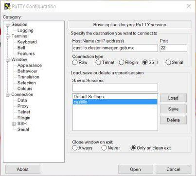
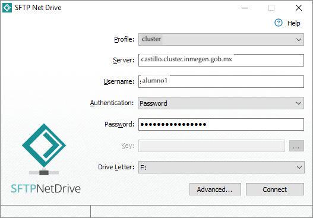
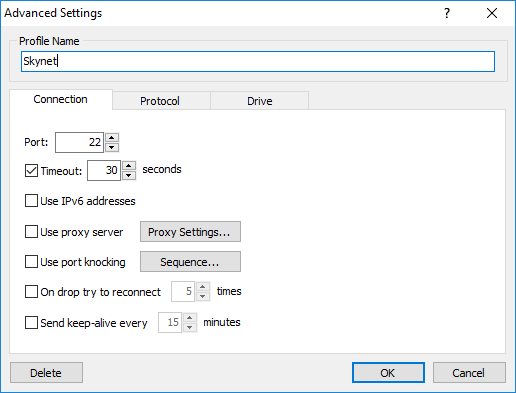
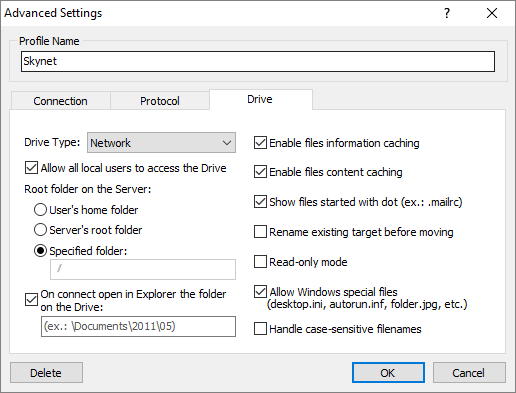

# github.com/hachepunto/bioinformatics


# Interface de línea de comandos


La **[Interface de línea de comandos](http://en.wikipedia.org/wiki/Command-line_interface)** (CLI) es un **método para interactuar** con un programa o sistema operativo de computadora que permite al usuario dar órdenes al programa **en forma de lineas de texto** sucesivas (líneas de comando). 

La **CLI** es menos usada por el usuario de computadoras promedio que prefiere usar una **[Interface Gráfica de Usuario](http://en.wikipedia.org/wiki/Command-line_interface)** (GUI) que ofrece una estética mejorada y una mayor simplificación, a costa de un mayor consumo de recursos computacionales, y, en general, de una reducción de la funcionalidad alcanzable.

La **CLI**, sin embargo, es preferida por los usuarios avanzados de cómputo dado que ofrece medios más concisos y poderosos para controlar programas o sistemas operativos.

Las órdenes dadas al Shell de linea de comandos comúnmente tiene alguna de las siguientes sintaxis:

+ *prompt comando parámetro1 parámetro2 parámetro3 ... parámetroN*
+ *prompt comando parámetro1 | comando parámetro2 | comando parámetro3 ... | comando parámetroN | > archivoSalida*

## Prompt

Caracter o caracteres que se muestran en la linea de comandos para indicar que está listo para recibir tus órdenes.

#### UNIX/GNU/Linux
```
usuario@máquina:~$
```

#### Mac OS X
```
máquina:~ usuario$
```

#### R
```
>
```

#### Python
```
>>>
```

# OpenSSH


[**OpenSSH**](https://www.openssh.com/) (Open Secure Shell) o **ssh** es un conjunto de herramientas para la comunicación segura entre computadoras usando el protocolo [**SSH**](https://www.ssh.com/ssh/protocol/). **OpenSSH** fue desarrollado como alternativa libre y de código abierto a la implementación SSH propietaria.
**OpenSSH** es en realidad un conjunto de programas que ofrecen una gran variedad de capacidades de hacer túneles seguros, muchos modos de autenticación y opciones de configuración sofisticada.


Conéctate a esta dirección:

<p align="center"> 
<big><tt>drona.inmegen.gob.mx</tt></big>
</p>


o, lo que es lo mismo, a esta IP:

<p align="center"> 
<big><tt>10.0.15.11</tt></big>
</p>


### Si estás en GNU/Linux o MacOSX

 
1. Abre la terminal. 
  - Si estás en GNU/Linux `Ctrl`+`Alt`+`T`. 
  - Si estás en MacOSX `cmd`+`space` y luego teclea `terminal`+`↩︎`.

2. Teclear lo que sigue sustituyendo \<usuario> por tu nombre de usuario:
	
	```
	$ ssh alumnoX@drona.inmegen.gob.mx
	```
o

	```
	$ ssh alumnoX@10.0.15.11
	```


3. Teclea tu contraseña (parecerá que no se está escribiendo nada) y da "enter" de nuevo

Tu contraseña es holaalumnoX (donde X es el número de alumno que te tocó). Te va a pedir que introduzcas una nueva contraseña y la repitas. Te sugerimos que uses la misma para facilitar tu acceso.

### Si estás en Windows

1. Abre [PuTTY](https://www.chiark.greenend.org.uk/~sgtatham/putty/latest.html) y escribe la dirección en el campo que dice "Host Name (or IP address)"

	```
	drona.inmegen.gob.mx
	```
o

	```
	10.0.15.11
	```




También puedes intentar con [MobaXterm](https://mobaxterm.mobatek.net/)

2. Clickea en `Open` (puede tardar unos segundo).

3. En la terminal que se abre, teclea tu nombre de usuario, da `enter`. 

4. Teclea tu contraseña (parecerá que no se está escribiendo nada) y da `enter` de nuevo.


## Byobu

[Byobu](http://byobu.co/) es un multiplexador de terminal. Sirve, entre otras cosas, para proteger el trabajo que hacemos en el cluster de posibles desconexiones inesperadas desde nuestra terminal. 
 

```
$ byobu
```

¿Notaron que de lindo es? ;¬)

Algunos atajos de teclado importantes de Byobu son:

`F2` Crea una nueva èstaña dentro de byobu

`⇪ + F2` Añade un panel a la terminal 

`⇪ + F8` Cambiar el orden de los páneles 

`F3` Cambia a la ventana anterior

`F4` Cambia a la ventana siguiente

`F6` Despégate de esta sesión 

Más atajos de teclado [aquí](http://byobu.co/documentation.html).


Veamos que podemos hacer aquí. Ve a la siguiente presentación:


Salimos de Byobu.

```
$ exit
```

Cerramos la conexión SSH

```
$ exit
```


# Comandos básicos en UNIX

Escribe uno por uno los siguientes comandos mientras explico:


***ls*** (list) es un programa para listar el contenido de la carpeta en la que estamos "parados".

```
$ ls
```
```
$ ls -la
```
***cd*** (change directory) es un programa para cambiar de directorio dentro del árbol de directorios del sistema.

```
$ cd
```

***pwd*** (print working directory) es un pequeño programa que imprime en pantalla la ruta hacia el directorio donde estamos trabajando.

```
$ pwd
```

***find*** (encontrar) Es un programa que te muestra la estructura de archivos de la carpeta deseada y te permite filtrar el resultado para encontrar carpetas o archivos.

```
$ find
```

  - Comando para abortar una tarea `Ctrl` + `C`

```
$ find /
```


### Estructura de archivos

En los sistemas UNIX los archivos están organizados por directorios. Los directorios son archivos especiales que contienen información que permite localizar otros archivos en los dispositivos de almacenamiento. Los directorios pueden contener a su vez otros directorios los cuales se denominan subdirectorios. A la estructura resultante de esta organización se le conoce como *estructura de árbol invertido*.


   - Directorio raíz o *root* `/`: Es aquel directorio que está sobre todos los directorios. 

```
$ ls /
```
   
   - Directorio de coneccion `~`:  Es un directorio especial que representa el directorio principal de casa usuario. 

```
$ cd
$ ls
$ cd /
$ ls ~
$ cd ~
$ ls
```

   - Directorio de trabajo `.`: El punto representa el directorio en el que estamos parados

```
$ ls .
```

   - Directorio superior `..`: Dos puntos representa el directorio arriba del que estamos parados

```
$ ls ..
$ cd ..
$ ls 
```

  - Listado en formato largo con `ls -l`:


  - Permisos de archivos

  


***mkdir*** (make directory) crea carpetas.

```
$ cd
$ mkdir datos.taller
```
```
$ cd datos.taller
```
```
$ ls
```
***wget*** (www get) Es un programa para descargar archivos de internet.

```
$ wget "https://raw.githubusercontent.com/hachepunto/bioinformatics/master/data/breastcancer_regulon.sif"
```

```
$ wget -O CO2_by_year.txt "https://raw.githubusercontent.com/hachepunto/bioinformatics/master/data/data_carbondioxideyearlyemissions.txt"
```

```
$ ls
```
***cat*** (concatenate) sirve para concatenar archivos uno tras.

```
$ cat breastcancer_regulon.sif
```

```
$ cat breastcancer_regulon.sif CO2_by_year.txt
```


***less*** es un paginador para ver archivos.

```
$ less CO2_by_year.txt
```

Dentro de `less` puedes usar el comando `/` para buscar tu país por ejemplo.

Para salir de `less` preciona la tecla `Q` 

***man*** (manual) es un programa que muestra los manuales de los programas.

```
$ man less
```
Las páginas de manuales son documentación acerca de los comandos y programas que tiene el sistema. Tienen una estructura constante lo que nos ayuda a ubicar la información que necesitamos más facilmente.

```
$ less -S CO2_by_year.txt
```
***cut*** Corta por columnas un archivo.

```
$ cut -f1 CO2_by_year.txt
```

### Salida estandar

La salida estandar (_Standar output_ o _stdout_) se refiere al _flujo estandarizado_ de datos que produce un programa de linea de comandos. Este flujo de datos, el cual es texto plano, facilita la exportación a diferentes dispositivos como impresoras, monitores o bien otros programas. 

**|**  ( **pipe** o tubería ) es un método para encadenar programas de tal modo que la salida de uno es la entrada del que sigue. Se usa una barra vertical para separar los programas a usar.

```
$ cut -f1 CO2_by_year.txt | less
```

Las pipes (o tuberías) son una de las herramientas más poderosas de la interface de linea de comandos. Nos permite operar con diferentes herramientas sobre un mismo conjunto de información sin modificar el archivo que contiene nuestros datos.


***sort*** ordena listas.

```
$ sort breastcancer_regulon.sif | less
```


``` 
$ cut -f1 breastcancer_regulon.sif | sort | less
```

``` 
$ cut -f1 breastcancer_regulon.sif | sort -u | less
```


***tail*** (final) muestra el final de un archivo.

```
$ tail breastcancer_regulon.sif | less
```

```
$ less breastcancer_regulon.sif
```

```
$ tail  -n +2 breastcancer_regulon.sif | less
```

```
$ cut -f1 breastcancer_regulon.sif | tail  -n +2 | less
```

```
$ cut -f1 breastcancer_regulon.sif | tail  -n +2 | sort -u | less
```

***sed*** (stream editor) sed es un poderoso programa que sustituye caracteres en archivos de texto.

```
$ sed -e 's/NA/0/g' CO2_by_year.txt | less -S
```

``` 
$ cut -f1 breastcancer_regulon.sif | tail  -n +2 | sort -u | sed -e 's/AFF4/AFF1/' -e 's/APBB2/APBB1/' | less
```

***>*** salva a archivo la salida estándar.


``` 
$ cut -f1,4 breastcancer_regulon.sif | tail  -n +2 | sort -u | sed -e 's/AFF4/AFF1/' -e 's/APBB2/APBB1/' > TFs.txt
```


```
$ ls
```


```
$ less TFs.txt
```

***uniq*** busca repetidos en una lista ordenada.

```
$ uniq TFs.txt |less
```

uniq requiere que los renglones estén ordenados ya que detecta renglones contiguos.

```
$ sort TFs.txt | uniq | less
```

```
$ cut -f1 breastcancer_regulon.sif | sort | uniq -c | less
```

```
$ cut -f1 breastcancer_regulon.sif | sort | uniq -c | sort -nr | less
```

***wc*** (word count) cuenta el número de palabras y de renglones.

```
$ wc TFs.txt breastcancer_regulon.sif
```

```
$ wc -l TFs.txt breastcancer_regulon.sif
```

```
$ cut -f2 breastcancer_regulon.sif | less
```


```
$ cut -f2 breastcancer_regulon.sif | wc -l
```

```
$ cut -f2 breastcancer_regulon.sif | sort -u | wc -l
```


***grep*** (get all lines matching the regular expression and print (g/re/p)) es una herramienta muy poderosa para buscar cadenas de texto dentro de un archivo. Está pensado para trabajar con expresiones regulares (que no trataremos en este curso).

```
$ grep "TP53" breastcancer_regulon.sif
```
```
$ grep "^TP53" breastcancer_regulon.sif
```

```
$ grep "BRCA" breastcancer_regulon.sif
```

```
$ grep "^TP53" breastcancer_regulon.sif | wc -l
```

```
$ grep "^TP53" breastcancer_regulon.sif | cut -f2 | sort -u | wc -l
```

```
$ grep "^TP53" breastcancer_regulon.sif | cut -f2 | sort -u > TP53_regulon.txt
```

```
$ cat TP53_regulon.txt
```
```
$ cat TP53_regulon.txt TFs.txt
```

***paste*** (pegar) pega columnas una contigua a la otra

```
$ paste TFs.txt TP53_regulon.txt | less
```


***mv*** (move) comando que sirve para mover o renombrar y archivo o carpeta.

```
$ ls -l
```

*Renombrar*
```
$ mv TFs.txt transcriptionFactors.txt
```

```
$ ls -l
```
*Mover*


```
$ mkdir factores_de_transcripcion
```

```
$ mv transcriptionFactors.txt factores_de_transcripcion/
```

```
$ ls 
$ ls factores_de_transcripcion/
```

***cp*** (copiar) Comando que sirve para copiar archivos o carpetas

```
$ cp TP53_regulon.txt factores_de_transcripcion/
```

```
$ ls 
$ ls factores_de_transcripcion/
```


***rm*** (remove) Es el comando que sirve para eliminar archivos o carpetas. No pregunta si sí deseas borrar, hace lo que le indicas.

*Borrar archivos*

```
$ rm TP53_regulon.txt factores_de_transcripcion/TP53_regulon.txt
```

*Borrar carpetas*


```
$ rm factores_de_transcripcion/
```
rm: factores_de_transcripcion/: is a directory


```
$ rm -r factores_de_transcripcion/
```

## rsync

[rsync](https://rsync.samba.org/) es una utilidad para la transferencia y sincronización eficiente  de archivos a travez de sistemas de cómputo. rsync se usa típicamente para sincronizar archivos y directorios entre dos sistemas distintos.

Sintaxis general:

```
rsync [OPTION] … SRC … [USER@]HOST:DEST
rsync [OPTION] … [USER@]HOST:SRC [DEST]
```

Por ejemplo


```
$ cd
$ rsync -avz <usuario>@castillo.cluster.inmegen.gob.mx:datos.taller .
```


Más info:
[Lista de comandos de UNIX en la Wikipedia](http://en.wikipedia.org/wiki/List_of_Unix_commands)


# SSHFS

[SSHFS](https://github.com/libfuse/sshfs) es un programa que usa el protocolo SSH para montar un sistema de archivos de un servidor remoto en nuestra computadora. Esto hace que el servidor se verá como un disco externo en nuestra computadora.


Software para GNU/Linux:

+ **[sshfs](http://fuse.sourceforge.net/sshfs.html)**  [(Tutorial)](https://www.digitalocean.com/community/tutorials/how-to-use-sshfs-to-mount-remote-file-systems-over-ssh)

```
$ sudo apt install sshfs
```

Software para Mac

+ **[SSHFS](https://github.com/libfuse/sshfs/releases)**

+ **[OSXFuse](https://osxfuse.github.io/)**


Software para Windows:

+ **[SFTP Net Drive](https://www.netdrive.net/)**


**Carpeta para montar servidor (Mac/Linux)**


```
$ cd
```

```
$ mkdir -p mnt/rogue1
```

**Montar el servidor remoto**

En Mac:

```
$ sshfs alumnoX@drona.inmegen.gob.mx: ~/mnt/rogue1 -o local -o volname=ROGUE1 
```

En GNU/Linux:

```
$ sshfs alumnoX@drona.inmegen.gob.mx: ~/mnt/rogue1 
```

En Windows

1) Abre Net Drive



2) Da click en el botón "Advanced..."



3) Da click en la pestaña Drive:



4) Da click en "OK"

5) Da click en "Connect"


Busca en tu navegador de archivos.

**Para desmontar:**

```
$ fusermount -u ~/rogue1
```

En Mac:

```
$ umount -u ~/rogue1
```

En Windows: Solo da desconectar en la ventana de Net Drive.

O bien expulsa como siempre haces con un dispositivo externo.


Mac [Function Keys.terminal](https://raw.githubusercontent.com/google/terminal-app-function-keys/master/Function%20Keys.terminal)


## Command Line Heroes en español: Todo un mar de shell

[**Spotify**](https://open.spotify.com/episode/1reWl4kV8q3oQMNtPi7RkS?si=d7FSWec-TXSb4xkYWQYIjA)


[**Apple Podcast**](https://podcasts.apple.com/mx/podcast/command-line-heroes-en-espa%C3%B1ol/id1530277079?i=1000546863915)


