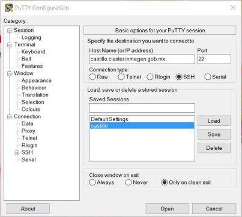
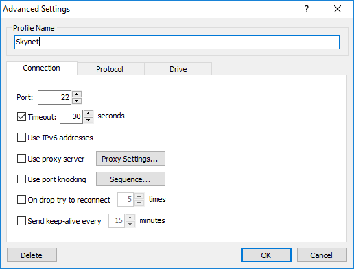

# OpenSSH


[**OpenSSH**](https://www.openssh.com/) (Open Secure Shell) o **ssh** es un conjunto de herramientas para la comunicación segura entre computadoras usando el protocolo [**SSH**](https://www.ssh.com/ssh/protocol/). **OpenSSH** fue desarrollado como alternativa libre y de código abierto a la implementación SSH propietaria.
**OpenSSH** es en realidad un conjunto de programas que ofrecen una gran variedad de capacidades de hacer túneles seguros, muchos modos de autenticación y opciones de configuración sofisticada.


Conéctate a esta dirección:

<p align="center"> 
<big><tt>drona.inmegen.gob.mx</tt></big>
</p>


o, lo que es lo mismo, a esta IP:

<p align="center"> 
<big><tt>10.0.15.11</tt></big>
</p>


### Si estás en GNU/Linux o MacOSX

 
1. Abre la terminal. 
  - Si estás en GNU/Linux `Ctrl`+`Alt`+`T`. 
  - Si estás en MacOSX `cmd`+`space` y luego teclea `terminal`+`↩︎`.

2. Teclear lo que sigue sustituyendo la X de "alumnoX" por el número de cuenta que te tocó:
	
	```
	$ ssh alumnoX@drona.inmegen.gob.mx
	```

o

	```
	$ ssh alumnoX@10.0.15.11
	```


3. Teclea tu contraseña (parecerá que no se está escribiendo nada) y da "enter" de nuevo. Tu contraseña es holaalumnoX (donde X es el número de alumno que te tocó). Te va a pedir que introduzcas una nueva contraseña y la repitas. Te sugerimos que uses la misma para facilitar tu acceso.

### Si estás en Windows 10 o posterior

1. En el cuadro de búsqueda de la barra de tareas busca “Símbolo del sistema” ("Command Prompt")
2. Teclear lo que sigue sustituyendo la X de "alumnoX" por el número de cuenta que te tocó:

    ```
	$ ssh alumnoX@drona.inmegen.gob.mx
	```

	o

	```
	$ ssh alumnoX@10.0.15.11
	```

3. Teclea tu contraseña (parecerá que no se está escribiendo nada) y da "enter" de nuevo. Tu contraseña es holaalumnoX (donde X es el número de alumno que te tocó).

### Si estás en Windows 8.1 o anterior


1. Abre [PuTTY](https://www.chiark.greenend.org.uk/~sgtatham/putty/latest.html) y escribe la dirección en el campo que dice "Host Name (or IP address)"

	```
	drona.inmegen.gob.mx
	```
o

	```
	10.0.15.11
	```




También puedes intentar con [MobaXterm](https://mobaxterm.mobatek.net/)

2. Clickea en `Open` (puede tardar unos segundo).

3. En la terminal que se abre, teclea tu nombre de usuario, da `enter`. 

4. Teclea tu contraseña (parecerá que no se está escribiendo nada) y da `enter` de nuevo.


## Byobu

[Byobu](http://byobu.co/) es un multiplexador[^1] de terminal. Sirve, entre otras cosas, para proteger el trabajo que hacemos en el cluster de posibles desconexiones inesperadas desde nuestra terminal. 

[^1]: Método por el cual múltiples señales analógicas o digitales se combinan en una señal a través de un medio compartido [Wikipedia](https://es.wikipedia.org/wiki/Multiplexaci%C3%B3n).

```
$ byobu
```


Algunos atajos de teclado importantes de Byobu son:

`F2` Crea una nueva èstaña dentro de byobu

`⇪ + F2` Añade un panel a la terminal 

`⇪ + F8` Cambiar el orden de los páneles 

`F3` Cambia a la ventana anterior

`F4` Cambia a la ventana siguiente

`F6` Despégate de esta sesión 

Más atajos de teclado [aquí](http://byobu.co/documentation.html).


### Cómo terminar la conexión.

Salimos de Byobu.

```
$ exit
```

Cerramos la conexión SSH

```
$ exit
```


### Veamos que podemos hacer aquí. Ve a la siguiente presentación:


## SSHFS

[SSHFS](https://github.com/libfuse/sshfs) es un programa que usa el protocolo SSH para montar un sistema de archivos de un servidor remoto en nuestra computadora. Esto hace que el servidor se verá como un disco externo en nuestra computadora.


Software para GNU/Linux:

+ **[sshfs](http://fuse.sourceforge.net/sshfs.html)**  [(Tutorial)](https://www.digitalocean.com/community/tutorials/how-to-use-sshfs-to-mount-remote-file-systems-over-ssh)

```
$ sudo apt install sshfs
```

Software para Mac

+ **[SSHFS](https://github.com/libfuse/sshfs/releases)**

+ **[OSXFuse](https://osxfuse.github.io/)**


Software para Windows:

+ **[SFTP Net Drive](https://www.netdrive.net/)**


**Carpeta para montar servidor (Mac/Linux)**


```
$ cd
```

```
$ mkdir -p mnt/rogue1
```

**Montar el servidor remoto**

En Mac:

```
$ sshfs alumnoX@drona.inmegen.gob.mx: ~/mnt/rogue1 -o local -o volname=ROGUE1 
```

En GNU/Linux:

```
$ sshfs alumnoX@drona.inmegen.gob.mx: ~/mnt/rogue1 
```

En Windows

1) Abre Net Drive


2) Da click en el botón "Advanced..."



3) Da click en la pestaña Drive:


4) Da click en "OK"

5) Da click en "Connect"


Busca en tu navegador de archivos.

**Para desmontar:**

```
$ fusermount -u ~/rogue1
```

En Mac:

```
$ umount -u ~/rogue1
```

En Windows: Solo da desconectar en la ventana de Net Drive.

O bien expulsa como siempre haces con un dispositivo externo.


Mac [Function Keys.terminal](https://raw.githubusercontent.com/google/terminal-app-function-keys/master/Function%20Keys.terminal)
