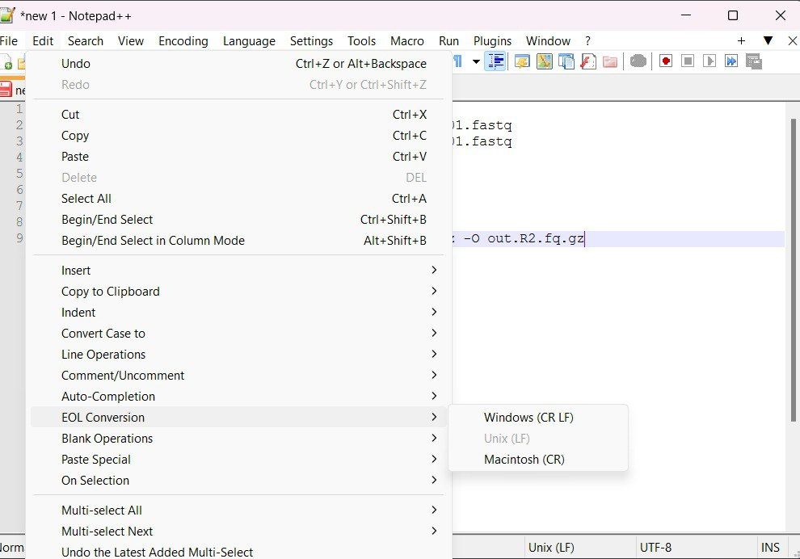
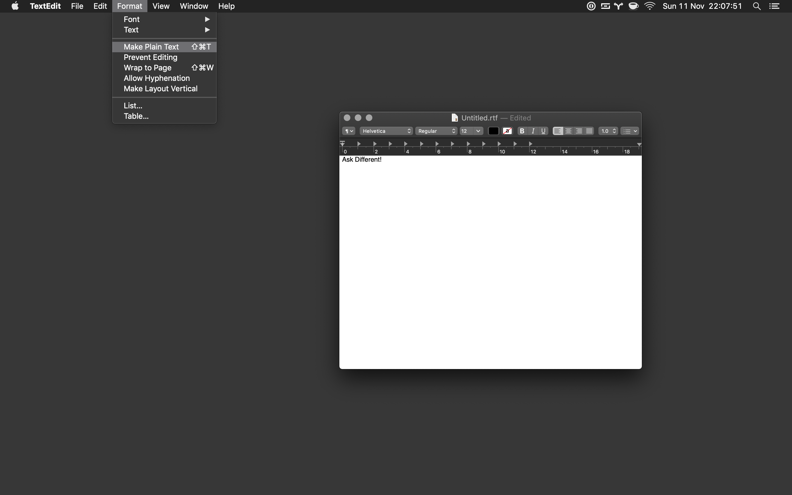

# github.com/hachepunto/bioinformatics

# Archivos Fastq

Ver presentación [**FastQ**](https://raw.githubusercontent.com/hachepunto/bioinformatics/master/presentaciones/FastQ.pdf)

En tu carpeta datos.taller copia los archivos fastq que vamos a utilizar:

```
cp /home/instalaciones/head_1mill_input_* ~/datos.taller/
```

Muévete a tu carpeta datos.taller:
```
cd ~/datos.taller
```
Despliega las primeraz líneas del archivo fastq.

```
head head_1mill_input_forward_R1_001.fastq
```


# FastQC

FastQC es el programa más utilizado para revisar la calidad de las secuencias de los experimentos de secuenciación masiva.

Liga: https://www.bioinformatics.babraham.ac.uk/projects/fastqc/

Para descargarlo puedes ir a la página de la herramienta [**FastQC**](https://www.bioinformatics.babraham.ac.uk/projects/fastqc/) y hacer click en <b>Download Now</b> y escoges la descarga adecuada para tu sistema operativo Linux/Windows o Mac. 
	
FastQC ya está descargado en Drona pero si quieres instalarlo en tu computadora, además de descargarlo, debes descomprimirlo y tener java instalado en el sistema. Las instrucciones se encuentran en la liga de descarga. Ahí además están las instrucciones de uso.
	
Hay dos modos de ejecutar FastQC: interactivo y no-interactivo. 
	
El interactivo sólo se puede utilizar si lo tienen instalado en su propia computadora. Por lo que aquí vamos a usarlo de manera no interactiva a través del servidor. La forma no-interactiva es la más común de utilizar porque de esta manera se incluye en los pipelines.
	
Interactivo:

```
fastqc
```

No-interactivo: 

```
fastqc read1 read2
```

Vamos a revisar la sección de la documentación donde se describen las gráficas ([**liga**](https://www.bioinformatics.babraham.ac.uk/projects/fastqc/Help/3%20Analysis%20Modules/)) y luego los ejemplos de datos de [**mala**](https://www.bioinformatics.babraham.ac.uk/projects/fastqc/bad_sequence_fastqc.html) y [**buena**](https://www.bioinformatics.babraham.ac.uk/projects/fastqc/good_sequence_short_fastqc.html) calidad. 

## Ejercicio:

En tu carpeta datos.taller copia los archivos fastq que vamos a utilizar:

```
cp /bodega/curso_intro_bioinfo/data/head_1mill_input_* ~/datos.taller/
```

Muévete a tu carpeta datos.taller:
```
cd ~/datos.taller
```

Crea una carpeta para guardar los resultados de FastQC:
```
mkdir salida_fastqc
```

Ejecuta Fastqc en los archivos que acabas de copiar:
```
fastqc head_1mill_input_forward_R1_001.fastq head_1mill_input_reverse_R2_001.fastq -o salida_fastqc
```

Desde tu computadora (ojo: no desde drona), puedes revisar los reportes html creados por FastQC en la carpeta salida_fastqc usando un navegador.

```
scp -r alumnoX@10.0.15.11:~/datos.taller/salida_fastqc .
```

Ahora en salida_fastqc estan los archivos html que puedes revisar con un navegador. 


	
# Fastp

Fastp es un programa para remover adaptadores y bases con baja calidad en nuestras secuencias.

Github: https://github.com/OpenGene/fastp

Fastp ya está en drona, pero si quieres descargarlo en tu computadora estos son los pasos:

```
# download the latest build
wget http://opengene.org/fastp/fastp
chmod a+x ./fastp

# or download specified version, i.e. fastp v0.23.4
wget http://opengene.org/fastp/fastp.0.23.4
mv fastp.0.23.4 fastp
chmod a+x ./fastp
```

## Ejercicio:

Para realizar el ejercicio con Fastp vamos a crear un script para ejecutar el comando. Para los usuarios de Windows, el script lo van a crear usando Notepad++, los de Mac usando TextEdit, los de Linux puede usar el editor de texto de su preferencia. Lo importante es que el programa que usen les genere un archivo en texto plano y que la codificación sea compatible con Unix. Para lograrlo sigan las siguientes instrucciones dependiendo del sistema operativo que tengan:

### Windows

Abre el programa Notepad++ (si no lo tienes instalado, instálalo) y ve a 
**Edit - EOL Conversion** y escoge **Unix (LF)** como se muestra en la imagen 


### Mac
Abre TextEdit y en **Format** selecciona **Make plain text** como se muestra en la imagen


## Ejercicio

Copia todo el texto de abajo y guárdalo en un archivo fastp.sh dentro en tu datos.taller.

```
bin=/bodega/curso_intro_bioinfo/bin/
read=~/datos.taller/head_1mill_input_forward_R1_001.fastq
mate=~/datos.taller/head_1mill_input_reverse_R2_001.fastq
outdir=~/datos.taller/salida_fastp

mkdir -p ${outdir}
cd ${outdir}

${bin}/fastp -i ${read} -I ${mate} -o out.R1.fq.gz -O out.R2.fq.gz
```
Si tu archivo lo creaste en tu computadora local, copialo al servidor con el siguiente comando:

```
scp fastp.sh alumnoX@drona.inmegen.gob.mx:~/datos.taller
```

Ejecutemos el script (en drona) que acabamos de crear

```
cd ~/datos.taller
bash fastp.sh
```

Revisemos con FastQC como se ven ahora las secuencias

```
mkdir salida_fastqc_trimmed
fastqc salida_fastp/out.R1.fq.gz salida_fastp/out.R2.fq.gz -o salida_fastqc_trimmed
```
De nuevo en tu computadora, revisa los resultados en un navegador y compara con los resultados antes y después de usar Fastp.

# Kallisto

Es un programa para la cuantificación de datos de bulk o single-cell RNA-seq

Liga: https://pachterlab.github.io/kallisto/

Primero revisa la sección <b>Getting started</b>

Para poder cuantificar Kallisto necesita un índice del transcriptoma de referencia. Kallisto nos proporciona unos ya generados o podemos generar el nuestro

Liga índices: https://github.com/pachterlab/kallisto-transcriptome-indices/releases

Información de los datos que vamos a usar:

Liga: https://rnabio.org/module-01-inputs/0001/05/01/RNAseq_Data/

## Ejercicio:

Ahora si probemos kallisto en una muestra.
Para este ejercicio vamos a utlilizar datos de la liga de arriba que ya están descargados en /bodega/curso_intro_bioinfo/data/ y un índice que ya tenemos preparado en /bodega/curso_intro_bioinfo/refs/.

En un archivo que se llame kallisto.sh copia los siguientes comandos:
```
idx="/bodega/curso_intro_bioinfo/refs/chr22.idx"
reads="/bodega/curso_intro_bioinfo/data/HBR_Rep1_ERCC-Mix2_Build37-ErccTranscripts-chr22.read1.fastq.gz"
mates="/bodega/curso_intro_bioinfo/data/HBR_Rep1_ERCC-Mix2_Build37-ErccTranscripts-chr22.read2.fastq.gz"

kallisto quant -i ${idx} -o salida_kallisto --rf-stranded $reads $mates
```
Guarda tu archivo y cópialo a drona a la carpeta datos.taller. 
Inspeccionamos lo que salió
```
ls salida_kallisto
```

El archivo que nos interesa en este momento es abundance.tsv que lo podemos ahora ver con los comandos more o less.
```
more salida_kallisto/abundance.tsv
```

Para hacer lo mismo ahora varias muestras podemos poner el comando de un bucle o loop. Copia el siguiente código a un archivo de texto que se llame hbr_kallisto.sh dentro de la carpeta datos.taller. 

```
idx="/bodega/curso_intro_bioinfo/refs/chr22.idx"

for id in HBR_Rep1 HBR_Rep2 HBR_Rep3
do
  reads="/bodega/curso_intro_bioinfo/data/${id}_ERCC-Mix2_Build37-ErccTranscripts-chr22.read1.fastq.gz"
  mates="/bodega/curso_intro_bioinfo/data/${id}_ERCC-Mix2_Build37-ErccTranscripts-chr22.read2.fastq.gz"
  
  kallisto quant -i ${idx} -o ~/datos.taller/salida_kallisto_${id} --rf-stranded $reads $mates
done
```

Ya que tenenos el archivo, desde drona, en datos.sync ejecutamos el siguiente comando:
```
bash hbr_kallisto.sh
```
Esto nos creo 3 carpetas con la cuanticación de las muestras que empiezan con HBR. 

Ejercicio: ahora intenta haces un archivo uhr_kallisto.sh que haga lo mismo en las muestras que empiezan con UHR.

## Tarea 

Descarga la anotación de genes de la página de Ensembl para humanos, [**archivo gtf**](https://ftp.ensembl.org/pub/current_gtf/homo_sapiens/Homo_sapiens.GRCh38.113.chr.gtf.gz), utilizando los comandos que ya conoces obten un archivo que contenga únicamente la columna con el id del transcript, el id del gen, y el nombre del gen para todos los genes en el chromosoma 22. Es importante no tener líneas repetidas.

El archivo una vez descargado es el siguiente Homo_sapiens.GRCh38.113.chr.gtf.gz, dado que termina en gz entonces quiere decir que está comprimido. Para poder verlo podemos usar el comando zcat, que es la variante del comando cat que nos permite ver archivos comprimidos y combinarlo con el comando head para ver las primeras líneas.

```
zcat Homo_sapiens.GRCh38.113.chr.gtf.gz | head
```

Para extraer solo las líneas que pertenecen al cromosoma 22 podemos usar grep, y usando ^ garantizamos que las líneas que extraemos son las que empiezan con '22'. 

```
zcat Homo_sapiens.GRCh38.113.chr.gtf.gz | grep '^22' 
```
Vamos a guardarlo en un archivo dado que es un paso tardado, para que las siguientes pruebas que hagamos corran más rápido.

```
zcat Homo_sapiens.GRCh38.113.chr.gtf.gz | grep '^22' > chr22.gtf
```

Ahora, en la tercera columna de nuestro archivo vemos que la información se encuentra a varios niveles por ejemplo CDS, exon, five_prime_utr, gene, start_codon, stop_codon, three_prime_utr y transcript. A nosotros solo nos interesa el nivel de transcript, entonces vamos a extaer solo los renglones que digan la palabra transcript. 

```
cat chr22.gtf | grep -w transcript
```

Finalmente vemos que la información que queremos esta en la columna 9, y necesitamos dividir esa información en las 3 columnas que necesitamos: transcript_id, gene_id y gene_name.

```
cat chr22.gtf | grep -w transcript | cut -f9
```

Ahí obtuvimos la columna 9, pero ahora para dividir la columna 9 en nuevas columnas vemos que la información está separada por ';', entonces podemos hacerlo de nuevo con cut, pero tenemos que decirle a cut que ya no vamos a usar tabs como separador de columnas y vamos a usar ;

```
cat chr.gtf | grep -w transcript | cut -f9 | cut -d';' -f1,3,5
```

Vemos que no todos los transcritos tienen nombre, por lo que ese campo lo tendremos que dejar en blanco para algunos. Empecemos por cortar las columnas que nos interesan:

```
cat chr22.gtf | grep -w transcript | cut -f9 | cut -d';' -f1,3,5 | cut -d' ' -f2,4,6 
```

Dado que ahora en la columna del nombre del gen, en los casos donde el transcrito pertenecía a un gen sin nombre, tenemos algo que no es nombre de gen en la tercera columna, por lo que usaremo sed para dejar en blanco esos nombres.

```
cat chr22.gtf | grep -w transcript | cut -f9 | cut -d';' -f1,3,5 | cut -d' ' -f2,4,6 | sed -E 's/(havana.*)//'
```

Nos quedan unas comillas y ;s volando por ahí, asi que las eliminamos:

```
cat chr22.gtf | grep -w transcript | cut -f9 | cut -d';' -f1,3,5 | cut -d' ' -f2,4,6 | sed -E 's/(havana.*)//' | tr -d '"' | tr -d ';'
```

Reemplazamos los espacios por tabs:

```
cat chr22.gtf | grep -w transcript | cut -f9 | cut -d';' -f1,3,5 | cut -d' ' -f2,4,6 | sed -E 's/(havana.*)//' | tr -d '"' | tr -d ';' | sed 's/\s/\t/g' 
```

Ahora si, ya tenemos lo que queríamos y lo ordenamos y eliminamos duplicados para finalmente guardarlo en un archivo 

```
cat chr22.gtf | grep -w transcript | cut -f9 | cut -d';' -f1,3,5 | cut -d' ' -f2,4,6 | sed -E 's/(havana.*)//' | tr -d '"' | tr -d ';' | sed 's/\s/\t/g' | sort -u > geneId_transcriptId_geneName_chr22.txt
```

