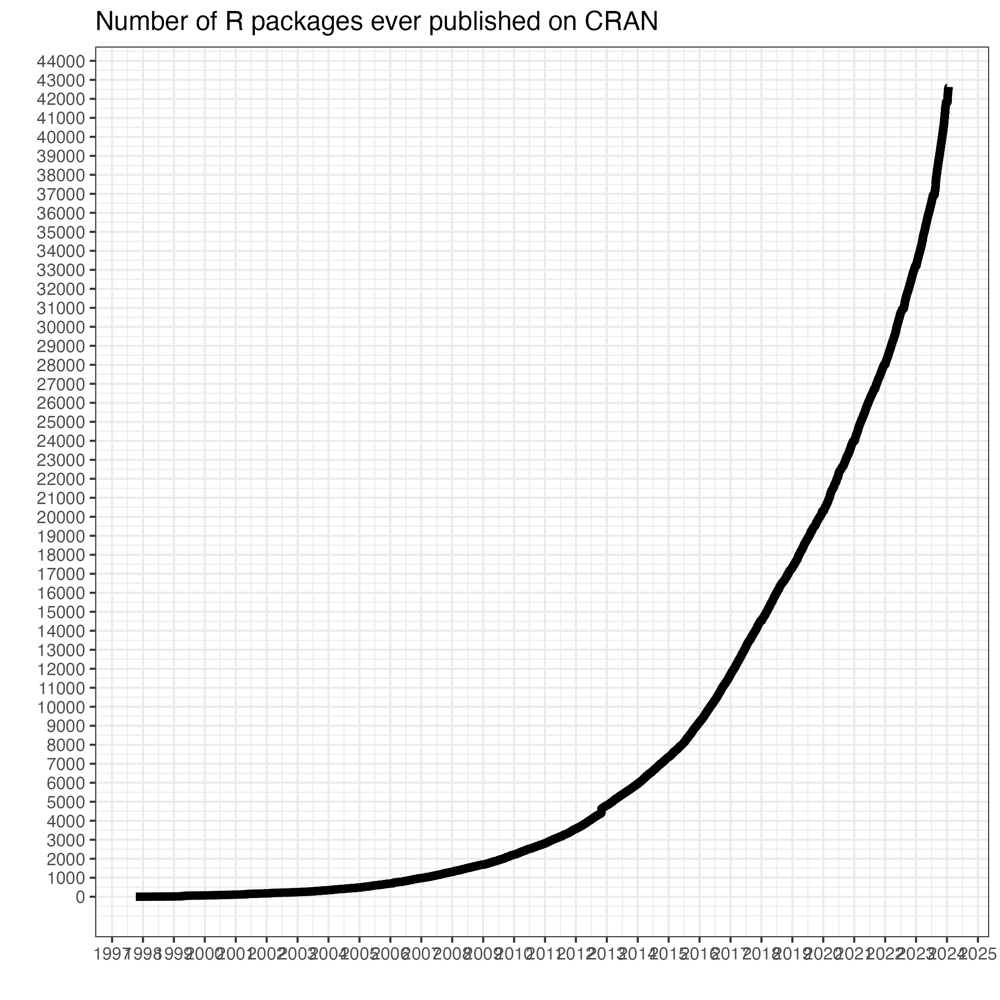

# github.com/hachepunto/bioinformatics

# Introducción a R

## ¿Qué es R?

**R es un *lenguaje* y *ambiente* de programación para análisis estadísticos y gráficos.**

***Lenguaje de programación* porque esta diseñado para expresar (comunicar) procesos que pueden ser llevados a cabo por computadoras.**

***Ambiente* porque es un sistema planeado y coherente de herramientas.**

## ¿Por qué usar R?

1. **R es LIBRE.** Al ser un proyecto GNU, uno puede: *utilizar R sin costo* e *inspeccionar/modificar el código* tanto como uno quiera. Y, no me nos importante, *compartir con quien quieras*.
2. **Gráficos y visualización.** R tiene excelentes herramientas para crear gráficos de alta calidad.
3. **Amplio set de herramientas estadísticas** Miles de análisis estadísticos clásicos y modernos están disponibles en R o en paquetes para R.




4. **Acceso a técnicas en desarrollo o recientemente desarrolladas.** Muchas técnicas analíticas son desarrolladas y están disponibles en R.
5. **Posibilidades sin límites** Si uno no encuentra lo que necesita, uno puede programarlas en R.

## ¿Cómo obtener R?

Descárgalo de su sitio oficial [The Comprehensive R Archive Network (CRAN)](https://cran.r-project.org/)

En este lugar descargas el intérprete de R y una interface muy sencilla para trabajar con el. 

Puedes obtener el *Entorno de Desarrollo Integrado* (IDE) para R más popular llamado RStudio de [este sitio](https://posit.co/download/rstudio-desktop/) (pero necesitas descargar R de todos modos).

## Usar el RStudio del servidor escuela del INMEGEN

Abre tu navegador y pon en la barra de dirección esta dirección:

<p align="center"> 
<big><tt>drona.inmegen.gob.mx:5282</tt></big>
</p>


Usar tu cuenta de alumnoX y tu contraseña para entrar.

## Copiar el material necesario para esta introducción

Uno de los formatos más populares de compresión en los ambientes GNU/Lunix es el de tar.gz. Comprimí el material de estas clases en este formato para que nos familiarizáramos con el. Vamos a copiar el archivo con los scripts de clase y vamos a descormprimirlos en nuestro home.

Copiar el tar a nuestro home

```
cp /bodega/curso_intro_bioinfo/R_Bioiformatics_2025.tar.gz ~/
```

Ahora extraemos el contenido de la carpeta

```
cd
tar -zxvf R_Bioiformatics_2025.tar.gz
```

Checa si hay una carpeta *R_Bioiformatics_2025* en tu home.
